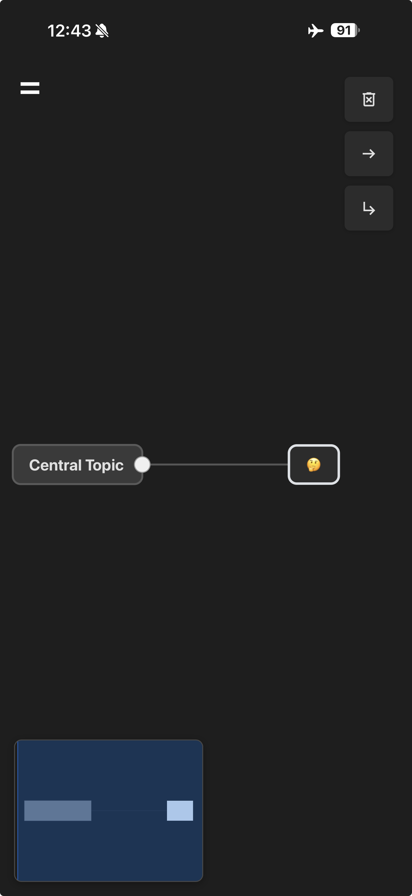
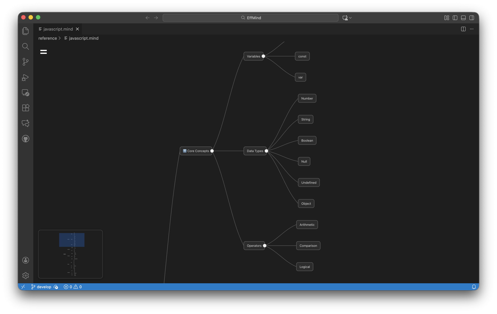

**🌐 Talen:**
[English](README.md) | [简体中文](README.zhs.md) | [繁體中文](README.zht.md) | [Nederlands](README.nl.md) | [Deutsch](README.de.md)

# EffMind: AI-ondersteunde Mindmap Tool

EffMind is een open-source mindmap-editor die werkt op zowel Web als Visual Studio Code. Ongeveer 70% van de code en deze documentatie is tot stand gekomen met behulp van **GitHub Copilot, ChatGPT en Google Gemini**.

> ⚠️ Opmerking: De code is door verschillende AI-tools gegenereerd, waardoor de stijl kan variëren. Functionaliteit is volledig, maar de code-structuur is nog niet volledig geoptimaliseerd.

## Technologie Stack

* Componenten gebouwd met **Lit.js** ([https://lit.dev/](https://lit.dev/))
* Native Web Components
* **SVG**-weergave voor knooppunten en verbindingen
* SPA-architectuur; VSCode-extensie hergebruikt hetzelfde front-end via Webview
* Ingebouwd meertalig systeem (JSON-woordenboeken + runtime-schakeling)
* **Ondersteunt donkere/lichte thema's, volgt automatisch systeeminstellingen**

## Functionaliteiten

### Mindmap Bewerken

* Knooppunten aanmaken, bewerken, verwijderen en verplaatsen
* Bewerken van kind- en broerknooppunten
* Canvas pannen en zoomen
* Automatische lay-out
* Ongedaan maken / opnieuw uitvoeren
* Mini-map
* Knooppunt zoeken
* Rechtsklikmenu voor knooppunten en canvas

### Import / Export

* Import: `.mind` (JSON)
* Export: `.mind`, `.png`, interactieve inklapbare `.svg`

### Meertaligheid

* Tekst onderhouden in JSON
* Runtime-taalwissel
* Gedeelde taalconfiguratie voor Web & VSCode
* Uitbreidbaar met aangepaste taalpakketten

### Thema's

* Donkere en lichte thema's
* Volgt standaard systeem `prefers-color-scheme`

## Platformondersteuning

### PWA

* Installatie op desktop of mobiel mogelijk
* Offline ondersteuning
* Getest op iOS 16 / iPadOS 16
* Android-test nog te doen

🔗 [https://mind.effwerk.com/](https://mind.effwerk.com/)

### VSCode-extensie

* Aangepaste editor voor `.mind`-bestanden
* Webview laadt volledige UI
* Ondersteuning voor bestandstoewijzing

🔗 [https://marketplace.visualstudio.com/items?itemName=EffMind.effmind](https://marketplace.visualstudio.com/items?itemName=EffMind.effmind)  